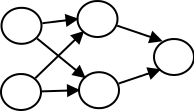

# Flappy POS-Logic

A feed-forward network simulation for a school presentation. The network has 2 inputs a single output and a two-neuron hidden layer. The aim is to control a simple Flappy Bird-style game.

